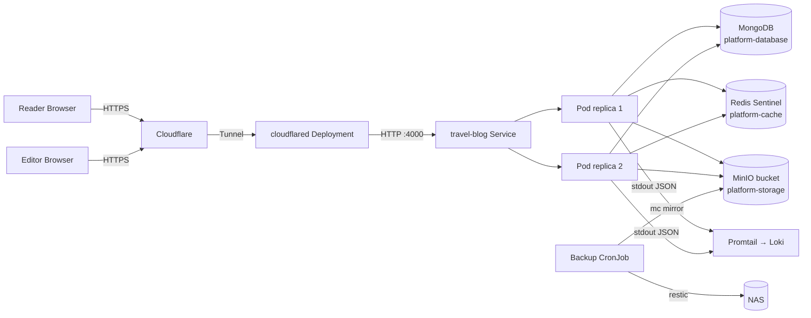
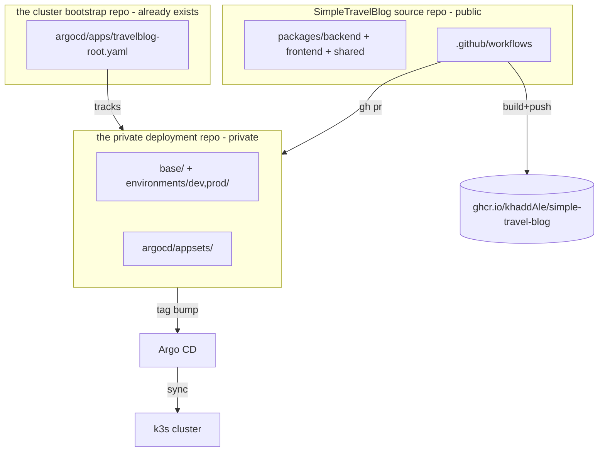
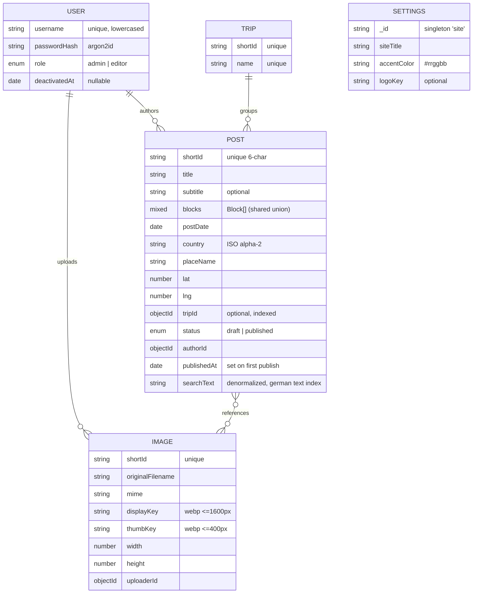

# Architecture

Skeleton created in Phase 0; data model and sequence diagrams are filled in as
the corresponding phases land.

## Runtime topology

## Repo / delivery topology

## Request flow

> Auth + image-pipeline sequence diagrams are added in Phase 4 / Phase 5.

## Data model

Mongoose models (`packages/backend/src/db/models/`). Posts carry an ordered
`Block[]` (the discriminated union from `@stb/shared`, validated on save) and a
denormalized German-language `searchText` rebuilt from title/subtitle/placeName +
block text on every save (german `$text` index).

Indexes: `User.username` unique · `Post.shortId` unique, `postDate -1`,
`country`, `tripId`, `searchText` text (german) · `Trip.shortId`+`name` unique ·
`Image.shortId` unique.

### Infrastructure adapters
- **Redis** (`src/redis/`): Sentinel-aware client factory; session store
  (`sess:<sid>` → `{userId, csrfSecret}`, sliding TTL) and login rate limiter
  (`loginfails:<user>:<ip>`, windowed counter).
- **Object storage** (`src/storage/s3.ts`): MinIO/S3 wrapper (put/get/delete),
  client injectable for tests.
- **Config** (`src/config.ts`): zod env schema, fail-fast at boot.
