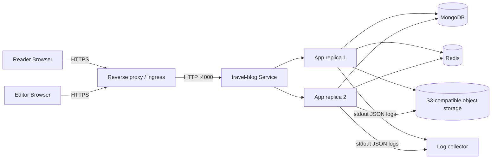
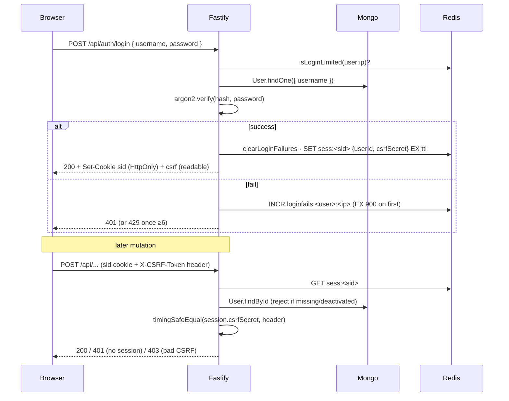
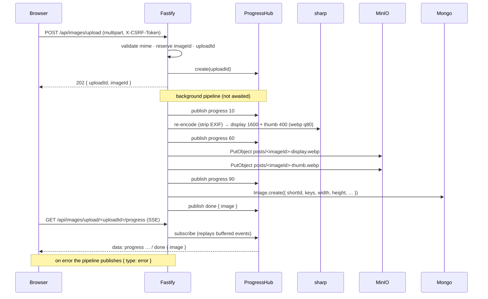
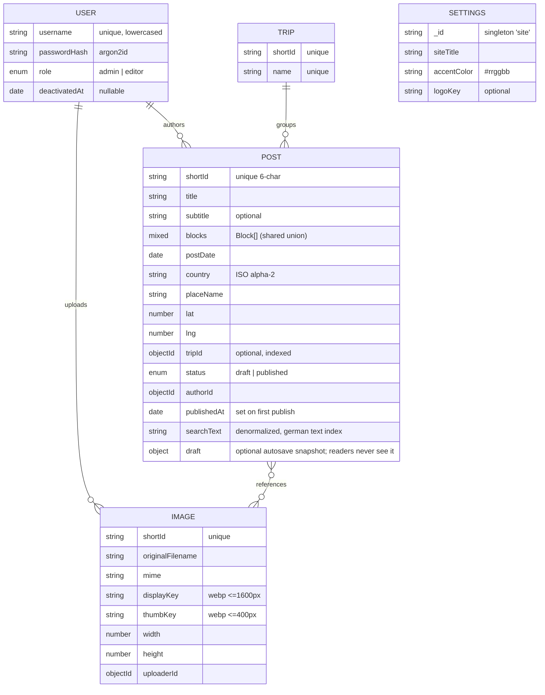
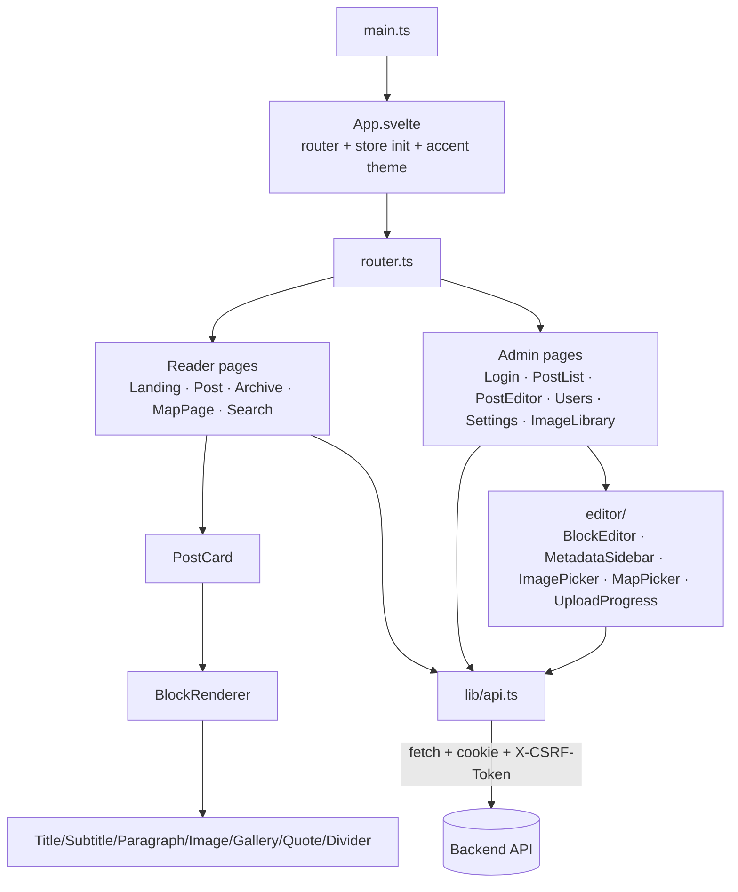

# Architecture

Skeleton created in Phase 0; data model and sequence diagrams are filled in as
the corresponding phases land.

## Runtime topology

The application is a stateless HTTP service (port `4000`) that serves both the API
and the built SPA. It depends on three external services and writes structured
JSON logs to stdout. How those are provisioned and exposed is deployment-specific
and out of scope for this repo.

## Delivery

This repo produces a single artifact: a multi-stage `linux/arm64` container image.
On a tagged release, CI builds that image and pushes it to a container registry
(GHCR). That image is the only output this repo is responsible for.

Deployment — orchestration manifests, ingress, TLS/exposure, secrets, backups, and
environment wiring — is environment-specific and lives outside this repo. To run
the app yourself you only need the image, a MongoDB, a Redis, an S3-compatible
bucket, and the environment variables it validates at boot (`src/config.ts`).

## Request flow

### Auth (login → CSRF-protected mutation → logout)

Sessions live in Redis (`sess:<sid>` → `{userId, csrfSecret}`); the session id is
delivered as a signed, HttpOnly, SameSite=Lax cookie. CSRF uses a double-submit
token: the per-session `csrfSecret` is mirrored into a readable `csrf` cookie and
must be echoed in `X-CSRF-Token` on mutations (verified constant-time against the
session). Login is rate-limited per `<username>:<ip>` (6 failures / 15 min → 429).

### Image upload pipeline (multipart → 202 → SSE → WebP variants)

Upload is asynchronous. The route reads the multipart file, validates its mime
type, reserves an image shortId, registers an upload channel, and returns `202`
immediately with `{ uploadId, imageId }`. Transcoding then runs in the
background: a single sharp re-encode strips all metadata (so EXIF/GPS never
reach storage), producing a display variant (≤1600px) and a thumbnail (≤400px),
both WebP. Both objects are written to MinIO, the `Image` document is persisted,
and a `done` event carrying the image DTO is published. The browser tracks
progress over a Server-Sent-Events channel; because every channel buffers its
events, a client that connects after the pipeline finished still replays the
terminal `done`/`error`.

### Delete-if-referenced guard

Trips and images cannot be deleted while content points at them. `DELETE
/api/trips/:id` checks for posts with that `tripId`; `DELETE /api/images/:id`
scans post blocks (image + gallery references). If any referrer exists the route
responds `409` with the list of referencing posts (`{ id, title }`) instead of
deleting — the editor's "where used" view (`GET /api/images/:id/usage`) surfaces
the same data.

## Data model

Mongoose models (`packages/backend/src/db/models/`). Posts carry an ordered
`Block[]` (the discriminated union from `@stb/shared`, validated on save) and a
denormalized German-language `searchText` rebuilt from title/subtitle/placeName +
block text on every save (german `$text` index).

A published post may also carry an optional, **typed** `draft` subdocument: a
snapshot of the editable fields written by the editor's autosave so an
in-progress edit never reaches readers (the public DTO mapper never projects
`draft`). Its mere presence is the authoritative `hasPendingDraft` flag exposed
on the post DTO and summary. "Veröffentlichen" promotes the draft to the
top-level fields and clears it; "Änderungen verwerfen" drops it. Draft writes
save with `timestamps: false`, so `updatedAt` (which readers/sitemap rely on)
only moves when live content actually changes.

Indexes: `User.username` unique · `Post.shortId` unique, `postDate -1`,
`country`, `tripId`, `searchText` text (german) · `Trip.shortId`+`name` unique ·
`Image.shortId` unique.

### Infrastructure adapters
- **Redis** (`src/redis/`): Sentinel-aware client factory; session store
  (`sess:<sid>` → `{userId, csrfSecret}`, sliding TTL) and login rate limiter
  (`loginfails:<user>:<ip>`, windowed counter).
- **Object storage** (`src/storage/s3.ts`): MinIO/S3 wrapper (put/get/delete),
  client injectable for tests.
- **Config** (`src/config.ts`): zod env schema, fail-fast at boot.

## Frontend (Svelte 5 SPA)

`packages/frontend` is a Svelte 5 (runes) single-page app, hash-routed with
`svelte-spa-router`. It talks only to the backend HTTP API; all state lives
server-side.

- **`lib/api.ts`** — single typed client over `fetch` (credentials included,
  CSRF header on mutations, `ApiError` carrying the parsed body for 409 etc.).
- **Stores** (`lib/*.svelte.ts`) — `auth` (current user, `me()` on boot) and
  `settings` (branding; `App.svelte` mirrors `accentColor` onto `--accent`).
- **Block renderers** (`blocks/`) — one component per block type behind
  `BlockRenderer`; reused by reader and editor preview.
- **Editor** (`admin/editor/`) — `BlockEditor` (▲/▼ reorder only, insert,
  delete), `ImagePicker` (paginated browse, filename filter, orphans toggle,
  upload via SSE), `MapPicker` (Leaflet click + Nominatim search),
  `UploadProgress` (consumes the upload SSE channel). `PostEditor` autosaves
  through `lib/autosave.ts` (2 s idle / 15 s cap, fire-time payload, single-flight
  + trailing coalesce); a new post is created on first valid autosave and the
  URL is swapped to its edit route via the router's `replace`.
- **List views** — reader lists (Landing, Archive, next-post lookup) and the
  admin "Beiträge" page consume lightweight head/summary projections (no
  `blocks`). Archive is an accordion grouping the heads by **Reise / Land / Jahr**
  client-side (one request, instant regroup); MapPage filters markers by Reise.
- **Routing/guard** — admin routes redirect to `/login` when unauthenticated;
  the editor reaches images/galleries through a Promise-based picker bridge.
  `lib/navGuard.ts` confirms in-app departures while edits aren't yet autosaved.
- All UI strings are German, inline (no i18n framework). Pure helpers
  (`plaintext`, `dates`, `archive`, `posts`, `nominatim`) are unit-tested;
  components use `@testing-library/svelte`. Leaflet is mocked in component tests.
