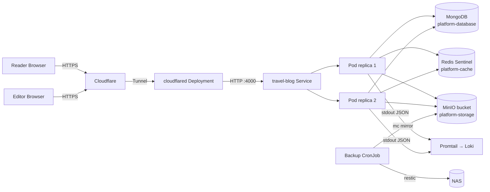
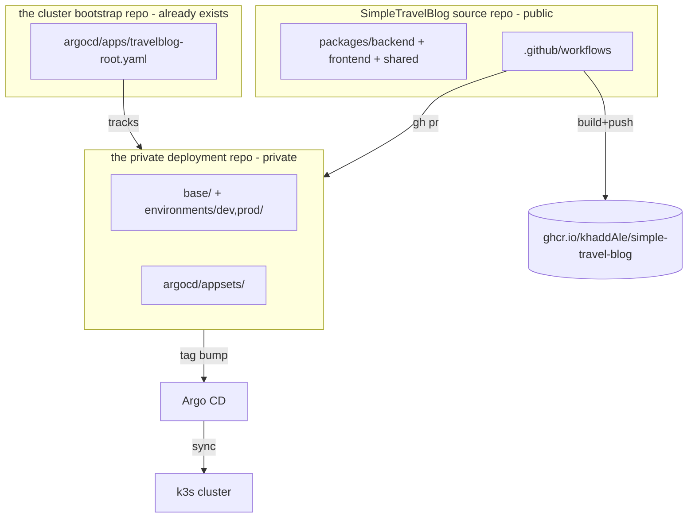

# Architecture

Skeleton created in Phase 0; data model and sequence diagrams are filled in as
the corresponding phases land.

## Runtime topology

## Repo / delivery topology

## Request flow

> Auth + image-pipeline sequence diagrams are added in Phase 4 / Phase 5.

## Data model

> Mongoose model ERD is added in Phase 3. Models: User, Post, Trip, Image,
> Settings (singleton). Posts carry an ordered `Block[]` (discriminated union
> defined in `@stb/shared`) and a denormalized German-language `searchText`.
