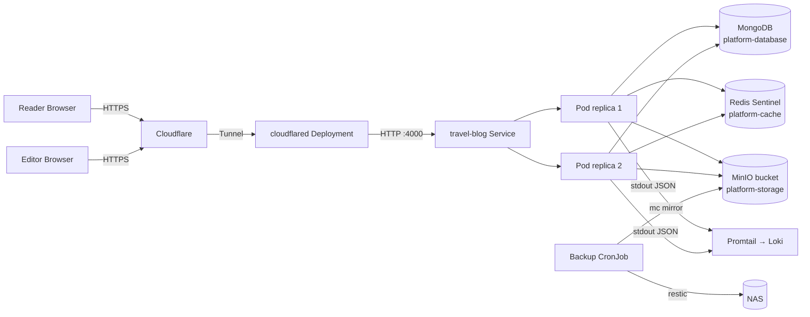
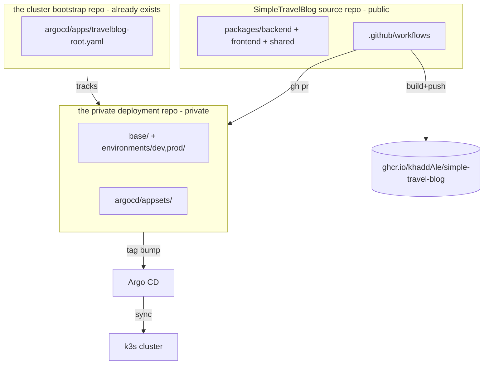
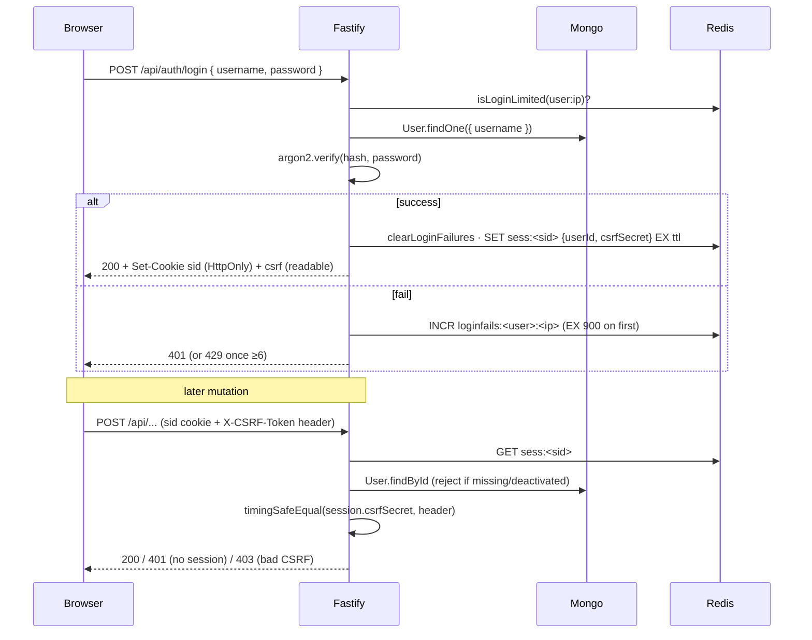
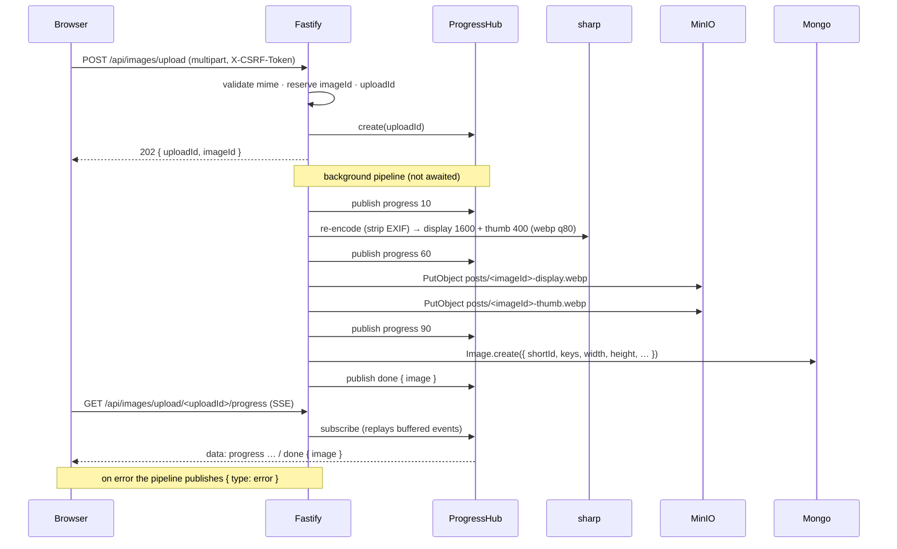
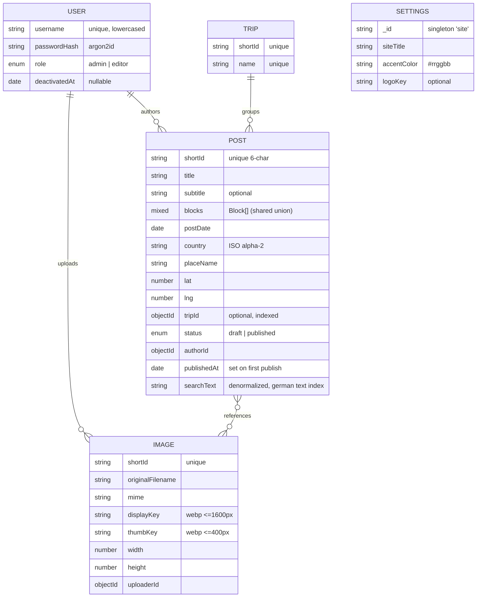

# Architecture

Skeleton created in Phase 0; data model and sequence diagrams are filled in as
the corresponding phases land.

## Runtime topology

## Repo / delivery topology

## Request flow

### Auth (login → CSRF-protected mutation → logout)

Sessions live in Redis (`sess:<sid>` → `{userId, csrfSecret}`); the session id is
delivered as a signed, HttpOnly, SameSite=Lax cookie. CSRF uses a double-submit
token: the per-session `csrfSecret` is mirrored into a readable `csrf` cookie and
must be echoed in `X-CSRF-Token` on mutations (verified constant-time against the
session). Login is rate-limited per `<username>:<ip>` (6 failures / 15 min → 429).

### Image upload pipeline (multipart → 202 → SSE → WebP variants)

Upload is asynchronous. The route reads the multipart file, validates its mime
type, reserves an image shortId, registers an upload channel, and returns `202`
immediately with `{ uploadId, imageId }`. Transcoding then runs in the
background: a single sharp re-encode strips all metadata (so EXIF/GPS never
reach storage), producing a display variant (≤1600px) and a thumbnail (≤400px),
both WebP. Both objects are written to MinIO, the `Image` document is persisted,
and a `done` event carrying the image DTO is published. The browser tracks
progress over a Server-Sent-Events channel; because every channel buffers its
events, a client that connects after the pipeline finished still replays the
terminal `done`/`error`.

### Delete-if-referenced guard

Trips and images cannot be deleted while content points at them. `DELETE
/api/trips/:id` checks for posts with that `tripId`; `DELETE /api/images/:id`
scans post blocks (image + gallery references). If any referrer exists the route
responds `409` with the list of referencing posts (`{ id, title }`) instead of
deleting — the editor's "where used" view (`GET /api/images/:id/usage`) surfaces
the same data.

## Data model

Mongoose models (`packages/backend/src/db/models/`). Posts carry an ordered
`Block[]` (the discriminated union from `@stb/shared`, validated on save) and a
denormalized German-language `searchText` rebuilt from title/subtitle/placeName +
block text on every save (german `$text` index).

Indexes: `User.username` unique · `Post.shortId` unique, `postDate -1`,
`country`, `tripId`, `searchText` text (german) · `Trip.shortId`+`name` unique ·
`Image.shortId` unique.

### Infrastructure adapters
- **Redis** (`src/redis/`): Sentinel-aware client factory; session store
  (`sess:<sid>` → `{userId, csrfSecret}`, sliding TTL) and login rate limiter
  (`loginfails:<user>:<ip>`, windowed counter).
- **Object storage** (`src/storage/s3.ts`): MinIO/S3 wrapper (put/get/delete),
  client injectable for tests.
- **Config** (`src/config.ts`): zod env schema, fail-fast at boot.
